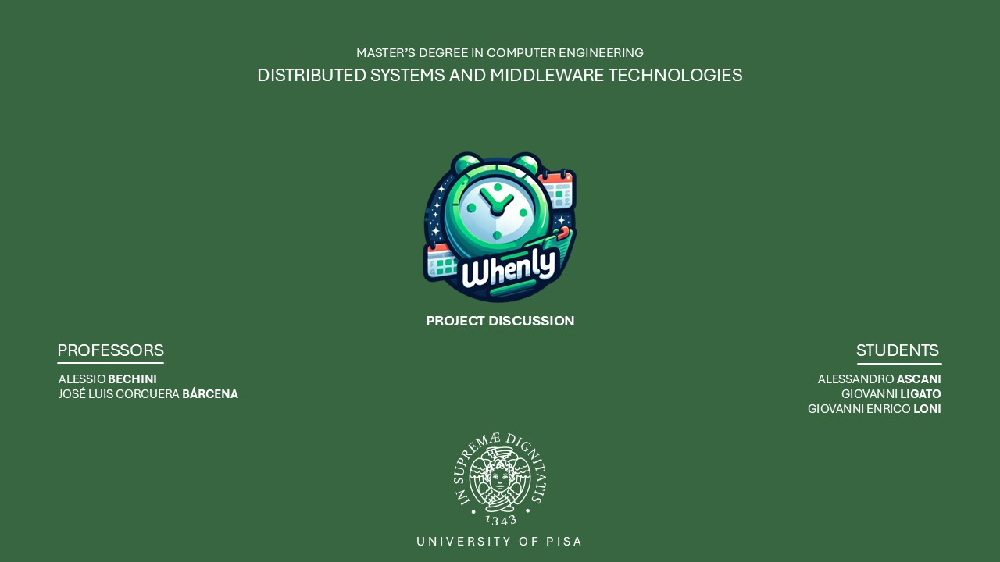

# Whenly



*Whenly* is a distributed event scheduling application designed to resolve the complexities of coordinating events with multiple participant constraints. Built with scalability, fault tolerance, and efficiency in mind, Whenly leverages a modular architecture that integrates a Java-based front-end/back-end with Erlang-based distributed event processing.

## Features

- **Distributed Constraint Management:** Aggregates and processes scheduling constraints using multiple Erlang Event Server Nodes.
- **Fault Tolerance:** Built-in recovery mechanisms ensure that node or process failures do not lead to data loss or system disruption.
- **Scalability:** A modular design allows independent scaling of the WebApp, Backend, and Event Server components.
- **User-Friendly Interface:** A responsive web interface implemented with JSP on Apache Tomcat enables easy event creation and constraint submission.

## Architecture

Whenly is composed of several key components:

- **WebApp Node:**  
  Implements the front-end using Java Server Pages (JSP) on Apache Tomcat. It communicates with the Backend via RESTful APIs.

- **Backend Node:**  
  Consists of two main sub-components:
  - **Java Backend Component:**  
    A Spring Boot application responsible for user authentication, event management, and task distribution. It exposes RESTful APIs to the WebApp and communicates with the Erlang Backend using JInterface.
  - **Erlang Backend Component:**  
    A distributed backend service that monitors Event Server Nodes, handles event creation and constraint requests, and coordinates final schedule computations.

- **Database Node:**  
  A centralized MySQL database that stores user credentials, event metadata, constraints, and final scheduling results. Critical data is also used to facilitate recovery processes.

- **Event Server Nodes:**  
  Distributed Erlang nodes that process incoming constraints, compute partial and final event solutions, and maintain fault tolerance through Mnesia DB and OTP supervision.

## Technologies

- **Frontend:**  
  Java Server Pages (JSP), Apache Tomcat

- **Backend:**  
  Java (Spring Boot, JInterface), Erlang (OTP, rebar3)

- **Database:**  
  MySQL (centralized), Mnesia DB (local storage for event servers)

- **Communication:**  
  HTTP (RESTful APIs) between WebApp and Java Backend; JInterface and asynchronous messaging between Java and Erlang; RPC calls among Erlang nodes.

## Project Structure

```
/
├── Documentation/           # Contains detailed project documentation and architectural diagrams
├── Slides/                  # Presentation slides used for project presentations
└── Implementation/
    ├── WebApp/              # Implementation of the web application frontend (JSP)
    ├── Backend/
    │   ├── JavaBackend/     # Spring Boot application and related services
    │   └── erlang_backend/  # Erlang backend application for communication and monitoring
    └── event_server/        # Erlang-based event server nodes implementation
```

## Documentation

Detailed documentation for Whenly, including architectural diagrams, design considerations, and implementation details, is available in the **Documentation** folder.

## Slides

Presentation slides used during project presentations can be found in the **Slides** folder.